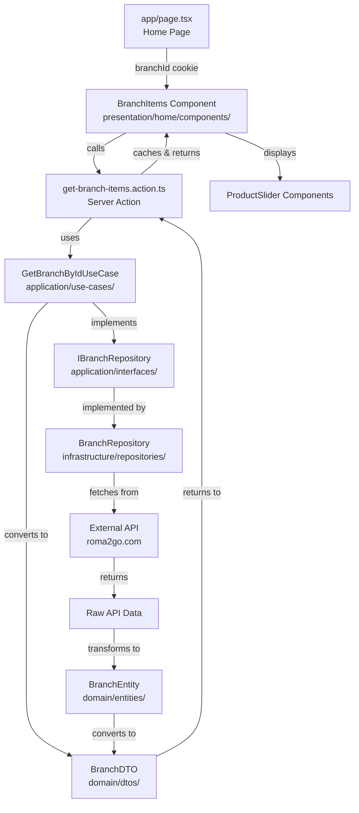

# Roma Pizza - Clean Architecture Documentation

## 📐 Project Structure

This project follows **Clean Architecture** principles with clear separation of concerns across four main layers:

```
RomaPizza/
├── domain/              # Business Logic & Entities
├── application/          # Use Cases & Business Rules
├── infrastructure/       # External Services & Data Access
└── presentation/        # UI & User Interface
```

---

## 🏗️ Architecture Layers

### 1. **Domain Layer** (`domain/`)

**Purpose**: Contains business entities, DTOs, and constants. No dependencies on other layers.

```
domain/
├── entities/           # Business entities (BranchEntity, ProductEntity, etc.)
├── dtos/              # Data Transfer Objects for serialization
└── constants/          # Business constants (SEO, delivery methods)
```

**Key Files:**

- `entities/branch.entity.ts` - Branch domain entity
- `entities/product.entity.ts` - Product domain entity
- `dtos/branch.dto.ts` - Branch DTO for client-server communication
- `dtos/product.dto.ts` - Product DTO for client-server communication
- `constants/seo.constant.ts` - SEO configuration
- `constants/delivery-methods.constant.ts` - Delivery method constants

### 2. **Application Layer** (`application/`)

**Purpose**: Contains use cases and business logic. Depends only on domain layer.

```
application/
├── interfaces/         # Repository interfaces (dependency inversion)
└── use-cases/         # Business use cases
```

**Key Files:**

- `interfaces/IBranchRepository.interface.ts` - Branch repository contract
- `interfaces/IProductRepository.interface.ts` - Product repository contract
- `use-cases/GetBranchByIdUseCase.ts` - Fetch single branch
- `use-cases/GetBranchesUseCase.ts` - Fetch branches by order type
- `use-cases/GetNearbyBranchesUseCase.ts` - Fetch nearby branches
- `use-cases/GetProductByIdUseCase.ts` - Fetch single product

### 3. **Infrastructure Layer** (`infrastructure/`)

**Purpose**: Implements external services, repositories, and data access. Depends on application interfaces.

```
infrastructure/
├── repositories/       # Repository implementations
└── factories/         # Dependency injection factory
```

**Key Files:**

- `repositories/BranchRepository.ts` - Branch data access implementation
- `repositories/ProductRepository.ts` - Product data access implementation
- `factories/UseCaseFactory.ts` - Creates and wires use cases

### 4. **Presentation Layer** (`presentation/`)

**Purpose**: UI components, pages, and user interactions. Depends on application layer.

```
presentation/
├── actions/          # Next.js server actions
├── home/             # Home page components
├── product/          # Product page components
└── store/           # Client-side state management
```

**Key Files:**

- `actions/get-branch-items.action.ts` - Server action for branch items
- `actions/get-branches.action.ts` - Server action for branches list
- `actions/get-product-details.action.ts` - Server action for product details
- `home/components/branchItems.tsx` - Branch products display
- `product/components/product-detail.tsx` - Product detail page

---

## 🔄 Data Flow Architecture

### General Flow Pattern

```
┌─────────────────────────────────────────────────────────────┐
│                    PRESENTATION LAYER                        │
│  ┌──────────────┐  ┌──────────────┐  ┌──────────────┐     │
│  │   Pages      │  │  Components  │  │   Actions    │     │
│  │  (app/)      │→ │  (presentation│→ │ (server)     │     │
│  └──────────────┘  └──────────────┘  └──────┬───────┘     │
└──────────────────────────────────────────────┼─────────────┘
                                               │
                                               ▼
┌─────────────────────────────────────────────────────────────┐
│                    APPLICATION LAYER                        │
│  ┌──────────────┐  ┌──────────────┐  ┌──────────────┐     │
│  │  Use Cases   │← │  Interfaces   │  │   Factory    │     │
│  │  (Business   │  │  (Contracts)  │  │  (DI)       │     │
│  │   Logic)     │  └──────────────┘  └──────────────┘     │
│  └──────┬───────┘                                          │
└─────────┼──────────────────────────────────────────────────┘
          │
          ▼
┌─────────────────────────────────────────────────────────────┐
│                  INFRASTRUCTURE LAYER                       │
│  ┌──────────────┐  ┌──────────────┐  ┌──────────────┐     │
│  │ Repositories │→ │  HTTP Client │  │   External   │     │
│  │ (Data Access)│  │  (axios)     │  │   APIs      │     │
│  └──────┬───────┘  └──────────────┘  └──────────────┘     │
└─────────┼──────────────────────────────────────────────────┘
          │
          ▼
┌─────────────────────────────────────────────────────────────┐
│                      DOMAIN LAYER                           │
│  ┌──────────────┐  ┌──────────────┐  ┌──────────────┐     │
│  │   Entities   │  │     DTOs     │  │  Constants   │     │
│  │  (Business   │  │  (Plain Obj) │  │  (Config)    │     │
│  │   Objects)   │  └──────────────┘  └──────────────┘     │
│  └──────────────┘                                          │
└─────────────────────────────────────────────────────────────┘
```

---

## 📊 Feature Flow Diagrams

### Feature 1: Get Branch Items

**Flow**: User views branch products → Server Action → Use Case → Repository → API → Entity → DTO → Component



**Files Involved:**

1. **Presentation**: `app/page.tsx` → `presentation/home/components/branchItems.tsx`
2. **Action**: `presentation/actions/get-branch-items.action.ts`
3. **Use Case**: `application/use-cases/GetBranchByIdUseCase.ts`
4. **Interface**: `application/interfaces/IBranchRepository.interface.ts`
5. **Repository**: `infrastructure/repositories/BranchRepository.ts`
6. **Domain**: `domain/entities/branch.entity.ts` → `domain/dtos/branch.dto.ts`

---

### Feature 2: Get Branches List

**Flow**: User selects delivery method → Server Action → Use Case → Repository → API → Entities → DTOs → Dialog

```mermaid
graph TD
    A[OrderFlowManager<br/>presentation/home/components/] -->|orderType| B[get-branches.action.ts<br/>Server Action]
    B -->|uses| C[GetBranchesUseCase<br/>application/use-cases/]
    C -->|implements| D[IBranchRepository<br/>application/interfaces/]
    C -->|converts to| E[BranchDTO[]<br/>domain/dtos/]
    D -->|implemented by| F[BranchRepository<br/>infrastructure/repositories/]
    F -->|fetches from| G[External API<br/>/stora/v1/branch-items]
    G -->|returns| H[Raw API Data Array]
    H -->|transforms to| I[BranchEntity[]<br/>domain/entities/]
    I -->|converts to| E
    E -->|returns to| B
    B -->|caches & returns| A
    A -->|displays| J[BranchSelectorDialog<br/>components/common/]
```

**Files Involved:**

1. **Presentation**: `presentation/home/components/order-flow-manager.tsx`
2. **Action**: `presentation/actions/get-branches.action.ts`
3. **Use Case**: `application/use-cases/GetBranchesUseCase.ts`
4. **Interface**: `application/interfaces/IBranchRepository.interface.ts`
5. **Repository**: `infrastructure/repositories/BranchRepository.ts`
6. **Domain**: `domain/entities/branch.entity.ts` → `domain/dtos/branch.dto.ts`

---

### Feature 3: Get Nearby Branches

**Flow**: User selects location on map → Server Action → Use Case → Repository → API → Entities → DTOs → Dialog

```mermaid
graph TD
    A[SelectDeliveryLocation<br/>presentation/home/components/] -->|lat, lng| B[get-nearby-branches.action.ts<br/>Server Action]
    B -->|uses| C[GetNearbyBranchesUseCase<br/>application/use-cases/]
    C -->|implements| D[IBranchRepository<br/>application/interfaces/]
    C -->|converts to| E[BranchDTO[]<br/>domain/dtos/]
    D -->|implemented by| F[BranchRepository<br/>infrastructure/repositories/]
    F -->|POST to| G[External API<br/>/stora/v1/branches/nearby]
    G -->|returns| H[Raw API Data Array]
    H -->|transforms to| I[BranchEntity[]<br/>domain/entities/]
    I -->|converts to| E
    E -->|returns to| B
    B -->|caches & returns| A
    A -->|displays| J[BranchSelectorDialog<br/>components/common/]
```

**Files Involved:**

1. **Presentation**: `presentation/home/components/methods/select-delivery-location.tsx`
2. **Action**: `presentation/actions/get-nearby-branches.action.ts`
3. **Use Case**: `application/use-cases/GetNearbyBranchesUseCase.ts`
4. **Interface**: `application/interfaces/IBranchRepository.interface.ts`
5. **Repository**: `infrastructure/repositories/BranchRepository.ts`
6. **Domain**: `domain/entities/branch.entity.ts` → `domain/dtos/branch.dto.ts`

---

### Feature 4: Get Product Details

**Flow**: User clicks product → Server Action → Use Case → Repository → API → Entity → DTO → Detail Page

```mermaid
graph TD
    A[app/product/[id]/page.tsx<br/>Product Page] -->|productId| B[get-product-details.action.ts<br/>Server Action]
    B -->|uses| C[GetProductByIdUseCase<br/>application/use-cases/]
    C -->|implements| D[IProductRepository<br/>application/interfaces/]
    C -->|returns| E[ProductEntity<br/>domain/entities/]
    D -->|implemented by| F[ProductRepository<br/>infrastructure/repositories/]
    F -->|fetches from| G[External API<br/>/custom-api/v1/products/]
    G -->|returns| H[Raw API Data]
    H -->|transforms to| E
    E -->|returns to| B
    B -->|caches & returns| A
    A -->|displays| I[ProductDetail Component<br/>presentation/product/components/]
    A -->|generates| J[Product Metadata<br/>SEO & Open Graph]
    A -->|includes| K[ProductStructuredData<br/>JSON-LD Schema]
```

**Files Involved:**

1. **Presentation**: `app/product/[id]/page.tsx`
2. **Action**: `presentation/actions/get-product-details.action.ts`
3. **Use Case**: `application/use-cases/GetProductByIdUseCase.ts`
4. **Interface**: `application/interfaces/IProductRepository.interface.ts`
5. **Repository**: `infrastructure/repositories/ProductRepository.ts`
6. **Domain**: `domain/entities/product.entity.ts` → `domain/dtos/product.dto.ts`

---

## 🔄 Complete Architecture Flow

### Request Flow (Presentation → Infrastructure)

```
┌──────────────────────────────────────────────────────────────┐
│ STEP 1: PRESENTATION LAYER                                   │
│ ┌────────────────────────────────────────────────────────┐  │
│ │ User Interaction (Page/Component)                       │  │
│ │ → Calls Server Action                                  │  │
│ │ → Passes parameters (branchId, productId, etc.)       │  │
│ └────────────────────────────────────────────────────────┘  │
└────────────────────────────┬─────────────────────────────────┘
                             │
                             ▼
┌──────────────────────────────────────────────────────────────┐
│ STEP 2: APPLICATION LAYER                                    │
│ ┌────────────────────────────────────────────────────────┐  │
│ │ Server Action                                          │  │
│ │ → Calls Use Case from Factory                         │  │
│ │ → Use Case implements business logic                  │  │
│ │ → Use Case calls Repository Interface                 │  │
│ │ → Converts Entity to DTO for serialization            │  │
│ └────────────────────────────────────────────────────────┘  │
└────────────────────────────┬─────────────────────────────────┘
                             │
                             ▼
┌──────────────────────────────────────────────────────────────┐
│ STEP 3: INFRASTRUCTURE LAYER                                 │
│ ┌────────────────────────────────────────────────────────┐  │
│ │ Repository Implementation                               │  │
│ │ → Implements Repository Interface                      │  │
│ │ → Makes HTTP request via axiosClient                  │  │
│ │ → Transforms API response to Domain Entity            │  │
│ │ → Returns Entity to Use Case                           │  │
│ └────────────────────────────────────────────────────────┘  │
└────────────────────────────┬─────────────────────────────────┘
                             │
                             ▼
┌──────────────────────────────────────────────────────────────┐
│ STEP 4: DOMAIN LAYER                                         │
│ ┌────────────────────────────────────────────────────────┐  │
│ │ Entity/DTO                                              │  │
│ │ → Entity contains business logic                        │  │
│ │ → DTO is plain object for serialization                │  │
│ │ → Constants define business rules                       │  │
│ └────────────────────────────────────────────────────────┘  │
└────────────────────────────┬─────────────────────────────────┘
                             │
                             ▼
┌──────────────────────────────────────────────────────────────┐
│ STEP 5: RESPONSE FLOW (Infrastructure → Presentation)        │
│ ┌────────────────────────────────────────────────────────┐  │
│ │ Entity → DTO → Use Case → Action → Component          │  │
│ │ → Component renders UI with data                       │  │
│ └────────────────────────────────────────────────────────┘  │
└──────────────────────────────────────────────────────────────┘
```

---

## 📁 File Structure Details

### Domain Layer Files

```
domain/
├── entities/
│   ├── branch.entity.ts          # BranchEntity class
│   ├── product.entity.ts          # ProductEntity class
│   ├── category.entity.ts         # CategoryEntity class
│   ├── variants.entity.ts         # VariantsEntity class
│   ├── location.entity.ts         # LocationEntity class
│   └── shipping-area.entity.ts    # ShippingAreaEntity class
├── dtos/
│   ├── branch.dto.ts              # BranchDTO type
│   ├── product.dto.ts             # ProductDTO & VariantDTO types
│   └── category.dto.ts            # CategoryDTO type
└── constants/
    ├── seo.constant.ts            # SEO configuration
    └── delivery-methods.constant.ts # Delivery method constants
```

### Application Layer Files

```
application/
├── interfaces/
│   ├── IBranchRepository.interface.ts   # Branch repository contract
│   ├── IProductRepository.interface.ts  # Product repository contract
│   └── iStorage.interface.ts            # Storage interface
└── use-cases/
    ├── GetBranchByIdUseCase.ts          # Get single branch
    ├── GetBranchesUseCase.ts             # Get branches by order type
    ├── GetNearbyBranchesUseCase.ts       # Get nearby branches
    └── GetProductByIdUseCase.ts          # Get single product
```

### Infrastructure Layer Files

```
infrastructure/
├── repositories/
│   ├── BranchRepository.ts              # Branch data access
│   ├── ProductRepository.ts              # Product data access
│   └── localStorage.repository.ts        # Local storage implementation
└── factories/
    └── UseCaseFactory.ts                 # Dependency injection factory
```

### Presentation Layer Files

```
presentation/
├── actions/
│   ├── get-branch-items.action.ts        # Server action: branch items
│   ├── get-branches.action.ts            # Server action: branches list
│   ├── get-nearby-branches.action.ts     # Server action: nearby branches
│   └── get-product-details.action.ts    # Server action: product details
├── home/
│   └── components/
│       ├── branchItems.tsx               # Branch products display
│       ├── order-flow-manager.tsx        # Order flow orchestration
│       ├── method-selection-page.tsx     # Method selection UI
│       ├── delivery-method-tabs.tsx      # Delivery method tabs
│       ├── productSlider.tsx            # Product carousel
│       └── structured-data.tsx          # SEO structured data
├── product/
│   └── components/
│       ├── product-detail.tsx            # Product detail page
│       └── product-structured-data.tsx   # Product SEO data
└── store/
    └── local.store.ts                    # Zustand state management
```

---

## 🔑 Key Design Patterns

### 1. **Dependency Inversion Principle**

- Application layer defines interfaces
- Infrastructure layer implements interfaces
- Use cases depend on abstractions, not concretions

### 2. **Repository Pattern**

- Abstracts data access logic
- Allows easy swapping of data sources
- Centralizes data transformation

### 3. **Use Case Pattern**

- Encapsulates business logic
- Single responsibility per use case
- Easy to test and maintain

### 4. **DTO Pattern**

- Separates domain entities from data transfer
- Enables serialization for client-server communication
- Prevents exposing internal entity structure

### 5. **Factory Pattern**

- Centralizes object creation
- Manages dependencies
- Simplifies testing with mocks

---

## 🚀 Caching Strategy

All server actions implement Next.js `unstable_cache` with:

- **Product Details**: 1 hour cache, key: `product-details-{productId}`
- **Branch Items**: 30 minutes cache, key: `branch-items-{branchId}`
- **Branches List**: 1 hour cache, key: `branches-{orderType}`
- **Nearby Branches**: 15 minutes cache, key: `nearby-branches-{lat}-{lng}`

---

## 📝 Best Practices

1. **Clean Architecture Compliance**

   - Domain layer has no dependencies
   - Application layer depends only on domain
   - Infrastructure depends on application interfaces
   - Presentation depends on application use cases

2. **Type Safety**

   - All entities and DTOs are strongly typed
   - Interfaces ensure contract compliance
   - TypeScript enforces type safety throughout

3. **Separation of Concerns**

   - Business logic in use cases
   - Data access in repositories
   - UI logic in components
   - Configuration in constants

4. **Testability**
   - Interfaces allow easy mocking
   - Use cases are pure functions
   - Dependencies injected via factory

---

## 🔍 How to Trace a Feature

To understand how a feature works:

1. **Start at Presentation**: Find the component/page that triggers the feature
2. **Find the Action**: Look for server actions in `presentation/actions/`
3. **Follow to Use Case**: Check which use case the action calls
4. **Check the Interface**: See what interface the use case depends on
5. **Find Implementation**: Locate the repository implementation
6. **See Data Flow**: Follow how data transforms from API → Entity → DTO → Component

---

## 📚 Additional Resources

- **Next.js Documentation**: https://nextjs.org/docs
- **Clean Architecture**: https://blog.cleancoder.com/uncle-bob/2012/08/13/the-clean-architecture.html
- **Repository Pattern**: https://martinfowler.com/eaaCatalog/repository.html

---

**Last Updated**: 2024
**Architecture Version**: 1.0
