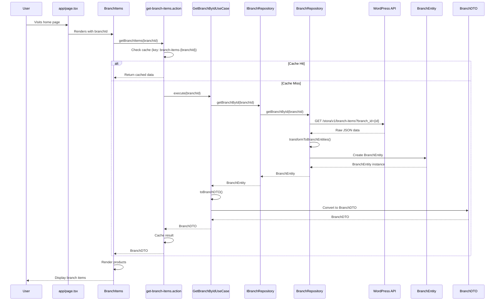
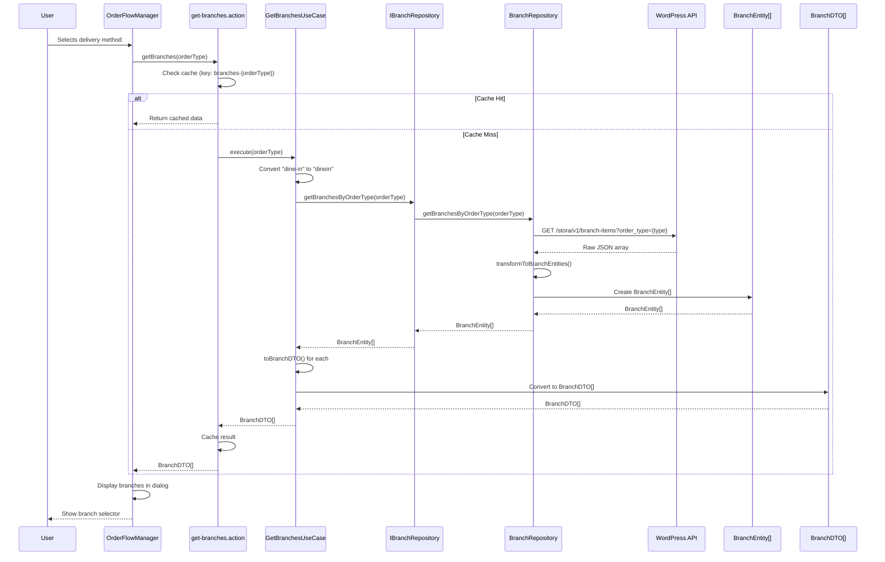
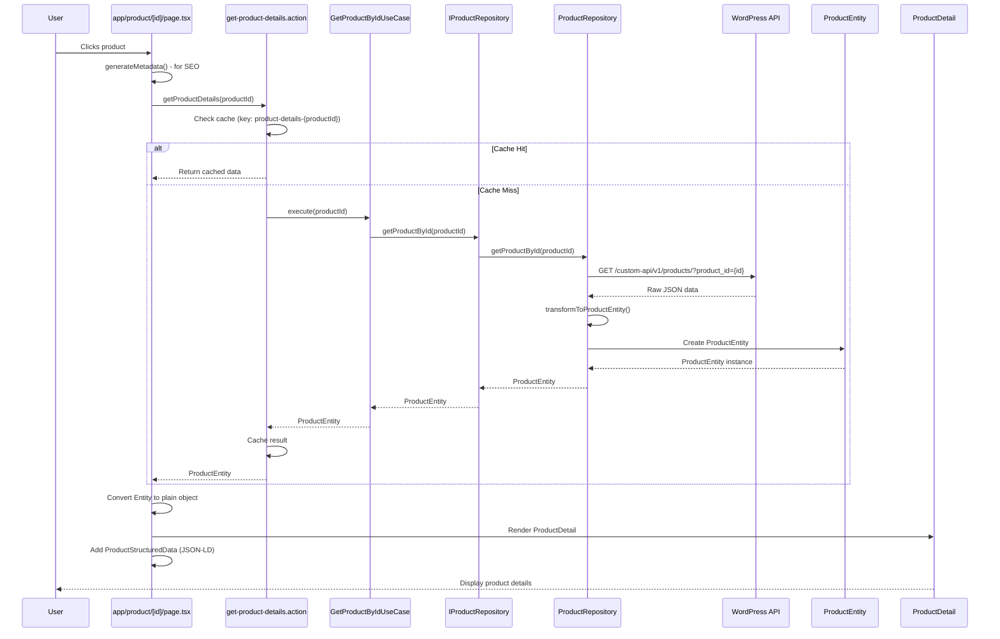
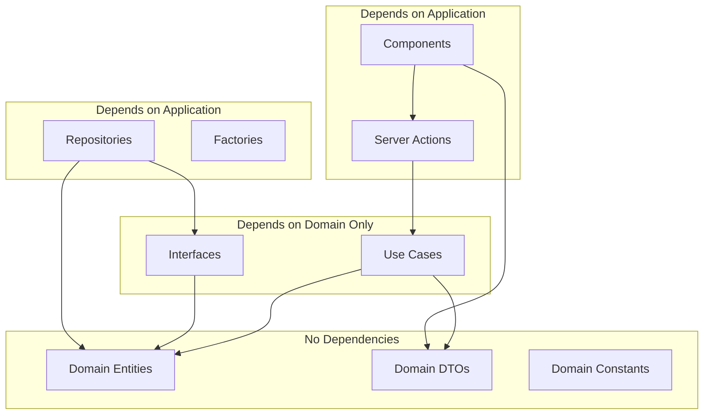

# Architecture Flow Graphs

## Complete System Architecture

```mermaid
graph TB
    subgraph "PRESENTATION LAYER"
        A1[app/page.tsx]
        A2[app/product/[id]/page.tsx]
        B1[branchItems.tsx]
        B2[order-flow-manager.tsx]
        B3[product-detail.tsx]
        C1[get-branch-items.action.ts]
        C2[get-branches.action.ts]
        C3[get-product-details.action.ts]
    end

    subgraph "APPLICATION LAYER"
        D1[GetBranchByIdUseCase]
        D2[GetBranchesUseCase]
        D3[GetProductByIdUseCase]
        E1[IBranchRepository Interface]
        E2[IProductRepository Interface]
        F1[UseCaseFactory]
    end

    subgraph "INFRASTRUCTURE LAYER"
        G1[BranchRepository]
        G2[ProductRepository]
        H1[axiosClient]
    end

    subgraph "DOMAIN LAYER"
        I1[BranchEntity]
        I2[ProductEntity]
        I3[BranchDTO]
        I4[ProductDTO]
        I5[SEO Constants]
    end

    subgraph "EXTERNAL"
        J1[WordPress API]
    end

    A1 --> B1
    A2 --> B3
    B1 --> C1
    B2 --> C2
    B3 --> C3

    C1 --> D1
    C2 --> D2
    C3 --> D3

    D1 --> E1
    D2 --> E1
    D3 --> E2

    D1 --> F1
    D2 --> F1
    D3 --> F1

    E1 --> G1
    E2 --> G2

    G1 --> H1
    G2 --> H1

    H1 --> J1

    J1 --> I1
    J1 --> I2

    I1 --> I3
    I2 --> I4

    I3 --> D1
    I4 --> D3

    D1 --> C1
    D2 --> C2
    D3 --> C3
```

## Feature 1: Get Branch Items - Detailed Flow



## Feature 2: Get Branches List - Detailed Flow



## Feature 3: Get Product Details - Detailed Flow



## Data Transformation Flow

```mermaid
graph LR
    A[API Response<br/>Raw JSON] -->|Transform| B[Domain Entity<br/>BranchEntity/ProductEntity]
    B -->|Business Logic| C[Use Case<br/>GetBranchByIdUseCase]
    C -->|Convert to DTO| D[Data Transfer Object<br/>BranchDTO/ProductDTO]
    D -->|Serialize| E[Server Action<br/>get-branch-items.action]
    E -->|Cache| F[Next.js Cache<br/>unstable_cache]
    F -->|Return| G[React Component<br/>BranchItems]
    G -->|Render| H[User Interface<br/>HTML/React]
```



## Dependency Graph



## Caching Flow

```mermaid
graph TD
    A[Component Request] -->|1. Check Cache| B{Cache Hit?}
    B -->|Yes| C[Return Cached Data]
    B -->|No| D[Call Use Case]
    D --> E[Fetch from API]
    E --> F[Transform to Entity]
    F --> G[Convert to DTO]
    G --> H[Store in Cache]
    H -->|Cache Key| I[branch-items-{branchId}<br/>product-details-{productId}<br/>branches-{orderType}]
    I --> J[Return to Component]
    C --> J
    J --> K[Render UI]
```

---

## Layer Responsibilities

| Layer | Responsibility | Can Depend On | Cannot Depend On |
|-------|---------------|---------------|------------------|
| **Domain** | Entities, DTOs, Constants | None | Nothing |
| **Application** | Use Cases, Interfaces | Domain | Infrastructure, Presentation |
| **Infrastructure** | Repositories, External Services | Application, Domain | Presentation |
| **Presentation** | UI, Pages, Actions | Application, Domain | Infrastructure (directly) |

---

## Key Principles

1. **Dependency Rule**: Dependencies point inward (toward Domain)
2. **Interface Segregation**: Small, focused interfaces
3. **Single Responsibility**: Each class/function has one job
4. **Open/Closed**: Open for extension, closed for modification
5. **Dependency Inversion**: Depend on abstractions, not concretions

