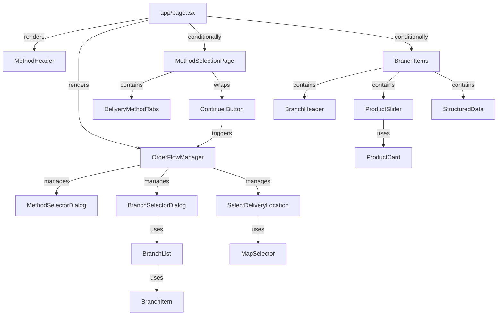
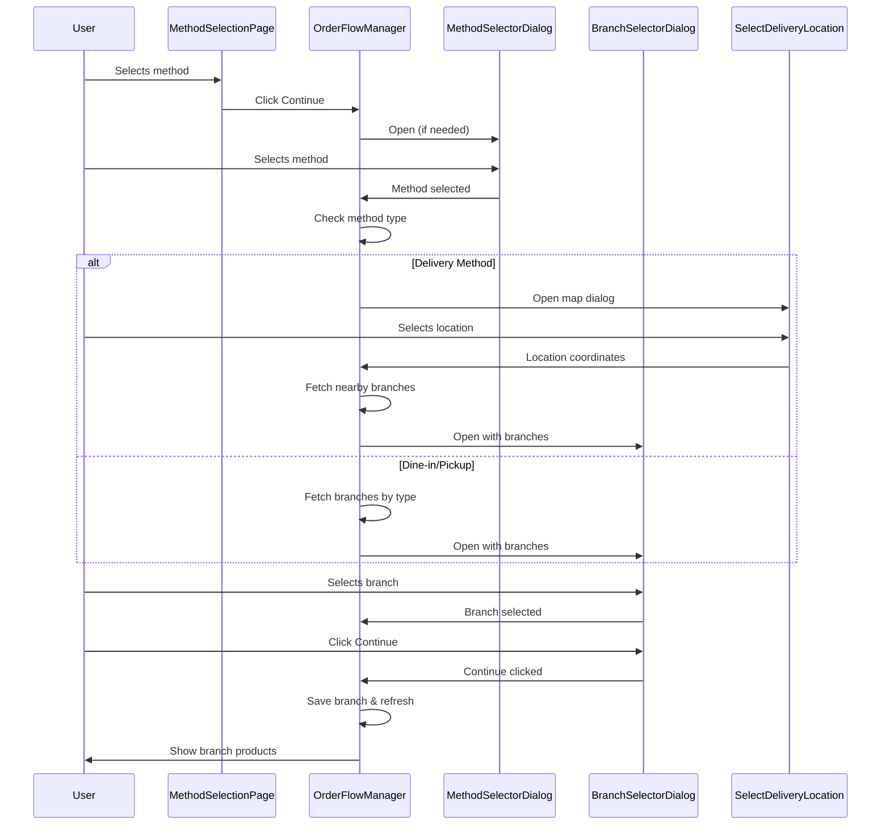
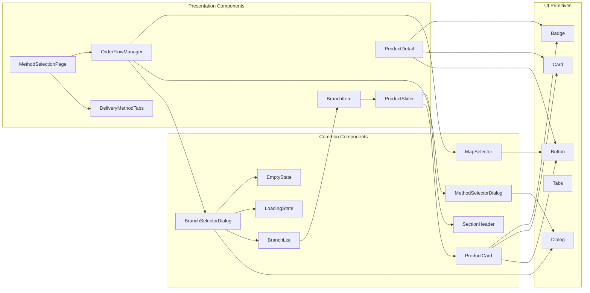

# Components Structure Documentation

## 📦 Component Architecture Overview

This document provides a comprehensive overview of all components in the Roma Pizza application, organized by layer and purpose.

---

## 🏗️ Component Hierarchy

```
app/
├── layout.tsx (Root Layout)
├── page.tsx (Home Page)
└── product/[id]/
    └── page.tsx (Product Detail Page)

components/
├── ui/ (Shadcn UI Primitives)
│   ├── button.tsx
│   ├── card.tsx
│   ├── dialog.tsx
│   ├── tabs.tsx
│   ├── badge.tsx
│   └── drawer.tsx
└── common/ (Reusable Business Components)
    ├── product-card.tsx
    ├── branch-list.tsx
    ├── branch-selector-dialog.tsx
    ├── method-selector-dialog.tsx
    ├── map-selector.tsx
    ├── section-header.tsx
    ├── loading-state.tsx
    └── empty-state.tsx

presentation/
├── home/components/
│   ├── method-selection-page.tsx
│   ├── method-header.tsx
│   ├── branch-header.tsx
│   ├── branchItems.tsx
│   ├── delivery-method-tabs.tsx
│   ├── order-flow-manager.tsx
│   ├── productSlider.tsx
│   ├── structured-data.tsx
│   └── methods/
│       ├── select-method.tsx
│       ├── select-branch/
│       │   ├── branchItem.tsx
│       │   └── selectBranch.tsx
│       ├── select-delivery-location.tsx
│       └── select-delivery-branch.tsx
└── product/components/
    ├── product-detail.tsx
    └── product-structured-data.tsx
```

---

## 🎨 Component Categories

### 1. **UI Primitives** (`components/ui/`)

Base components from Shadcn UI, styled with Tailwind CSS.

### 2. **Common Components** (`components/common/`)

Reusable business components used across the application.

### 3. **Presentation Components** (`presentation/`)

Feature-specific components organized by domain (home, product).

---

## 📋 Component Reference

## UI Primitives (`components/ui/`)

### Button

**File**: `components/ui/button.tsx`  
**Type**: Client Component  
**Purpose**: Styled button component with variants

**Variants**:

- `default` - Primary action button
- `destructive` - Delete/danger actions
- `outline` - Secondary actions
- `secondary` - Alternative style
- `ghost` - Minimal style
- `link` - Link-style button

**Sizes**: `default`, `sm`, `lg`, `icon`, `icon-sm`, `icon-lg`

**Usage**:

```tsx
<Button variant="default" size="lg">
  Click Me
</Button>
```

---

### Card

**File**: `components/ui/card.tsx`  
**Type**: Client Component  
**Purpose**: Container component for content sections

**Sub-components**:

- `CardHeader` - Card header section
- `CardTitle` - Card title
- `CardDescription` - Card description
- `CardContent` - Main card content
- `CardFooter` - Card footer section

**Usage**:

```tsx
<Card>
  <CardHeader>
    <CardTitle>Title</CardTitle>
  </CardHeader>
  <CardContent>Content</CardContent>
</Card>
```

---

### Dialog

**File**: `components/ui/dialog.tsx`  
**Type**: Client Component  
**Purpose**: Modal dialog component (Radix UI)

**Sub-components**:

- `DialogTrigger` - Opens the dialog
- `DialogContent` - Dialog content wrapper
- `DialogHeader` - Dialog header section
- `DialogTitle` - Dialog title (required for a11y)
- `DialogDescription` - Dialog description
- `DialogFooter` - Dialog footer section

**Usage**:

```tsx
<Dialog>
  <DialogTrigger>Open</DialogTrigger>
  <DialogContent>
    <DialogHeader>
      <DialogTitle>Title</DialogTitle>
    </DialogHeader>
  </DialogContent>
</Dialog>
```

---

### Tabs

**File**: `components/ui/tabs.tsx`  
**Type**: Client Component  
**Purpose**: Tab navigation component (Radix UI)

**Sub-components**:

- `TabsList` - Container for tab triggers
- `TabsTrigger` - Individual tab button
- `TabsContent` - Tab panel content

**Usage**:

```tsx
<Tabs>
  <TabsList>
    <TabsTrigger value="tab1">Tab 1</TabsTrigger>
  </TabsList>
  <TabsContent value="tab1">Content</TabsContent>
</Tabs>
```

---

### Badge

**File**: `components/ui/badge.tsx`  
**Type**: Client Component  
**Purpose**: Status indicator badge

**Variants**: `default`, `secondary`, `destructive`, `outline`, `success`

**Usage**:

```tsx
<Badge variant="success">Open</Badge>
```

---

## Common Components (`components/common/`)

### ProductCard

**File**: `components/common/product-card.tsx`  
**Type**: Client Component  
**Purpose**: Displays a single product in a card format

**Props**:

```typescript
interface ProductCardProps {
  product: ProductCardData;
  onAddToCart?: (productId: string) => void;
  showAddButton?: boolean;
  className?: string;
}
```

**Features**:

- Product image display
- Product name and description
- Price display
- Stock status badge
- Add to cart button
- Click to navigate to product detail

**Usage**:

```tsx
<ProductCard product={productData} onAddToCart={handleAddToCart} />
```

---

### BranchList

**File**: `components/common/branch-list.tsx`  
**Type**: Client Component  
**Purpose**: Renders a list of branch items

**Props**:

```typescript
interface BranchListProps {
  branches: BranchDTO[];
  selectedBranch: BranchDTO | null;
  onBranchSelect: (branch: BranchDTO) => void;
}
```

**Features**:

- Displays multiple branches
- Handles branch selection
- Visual feedback for selected branch

**Usage**:

```tsx
<BranchList
  branches={branches}
  selectedBranch={selectedBranch}
  onBranchSelect={handleSelect}
/>
```

---

### BranchSelectorDialog

**File**: `components/common/branch-selector-dialog.tsx`  
**Type**: Client Component  
**Purpose**: Dialog for selecting a branch

**Props**:

```typescript
interface BranchSelectorDialogProps {
  open: boolean;
  onOpenChange: (open: boolean) => void;
  title: string;
  description: string;
  branches: BranchDTO[];
  selectedBranch: BranchDTO | null;
  onBranchSelect: (branch: BranchDTO) => void;
  onContinue: () => void;
  loading?: boolean;
  error?: string | null;
  headerAction?: React.ReactNode;
}
```

**Features**:

- Modal dialog interface
- Branch list display
- Loading state
- Error state
- Empty state
- Continue button (disabled until branch selected)
- Optional header action (e.g., "Change location" button)

**Usage**:

```tsx
<BranchSelectorDialog
  open={isOpen}
  onOpenChange={setIsOpen}
  title="اختر الفرع"
  branches={branches}
  selectedBranch={selected}
  onBranchSelect={handleSelect}
  onContinue={handleContinue}
  loading={loading}
  error={error}
/>
```

---

### MethodSelectorDialog

**File**: `components/common/method-selector-dialog.tsx`  
**Type**: Client Component  
**Purpose**: Dialog for selecting delivery method

**Props**:

```typescript
interface MethodSelectorDialogProps {
  open: boolean;
  onOpenChange: (open: boolean) => void;
  selectedMethod: DeliveryMethod | null;
  onMethodSelect: (method: DeliveryMethod) => void;
  onContinue: () => void;
}
```

**Features**:

- Method selection interface
- Visual method cards
- Continue button

**Usage**:

```tsx
<MethodSelectorDialog
  open={isOpen}
  onOpenChange={setIsOpen}
  selectedMethod={selected}
  onMethodSelect={handleSelect}
  onContinue={handleContinue}
/>
```

---

### MapSelector

**File**: `components/common/map-selector.tsx`  
**Type**: Client Component  
**Purpose**: Google Maps component for location selection

**Props**:

```typescript
interface MapSelectorProps {
  onLocationSelect: (location: Location) => void;
  initialLocation?: Location;
  className?: string;
}
```

**Features**:

- Google Maps integration
- Click to select location
- Marker display
- Location coordinates extraction

**Usage**:

```tsx
<MapSelector
  onLocationSelect={(loc) => handleSelect(loc.latitude, loc.longitude)}
  initialLocation={defaultLocation}
/>
```

---

### SectionHeader

**File**: `components/common/section-header.tsx`  
**Type**: Client Component  
**Purpose**: Reusable section header component

**Props**:

```typescript
interface SectionHeaderProps {
  title: string;
  description?: string;
  action?: React.ReactNode;
  variant?: "default" | "centered";
  className?: string;
}
```

**Usage**:

```tsx
<SectionHeader
  title="Category Name"
  description="Category description"
  action={<Button>Action</Button>}
/>
```

---

### LoadingState

**File**: `components/common/loading-state.tsx`  
**Type**: Client Component  
**Purpose**: Loading indicator component

**Props**:

```typescript
interface LoadingStateProps {
  text?: string;
  size?: "sm" | "md" | "lg";
  className?: string;
}
```

**Usage**:

```tsx
<LoadingState text="جاري التحميل..." size="lg" />
```

---

### EmptyState

**File**: `components/common/empty-state.tsx`  
**Type**: Client Component  
**Purpose**: Empty state display component

**Props**:

```typescript
interface EmptyStateProps {
  icon?: React.ReactNode;
  title?: string;
  description?: string;
  action?: React.ReactNode;
  className?: string;
}
```

**Usage**:

```tsx
<EmptyState
  icon={<AlertCircle />}
  title="لا توجد فروع متاحة"
  description="لا توجد فروع متاحة لهذا النوع من الطلب حالياً"
/>
```

---

## Presentation Components (`presentation/`)

### Home Page Components

#### MethodSelectionPage

**File**: `presentation/home/components/method-selection-page.tsx`  
**Type**: Client Component  
**Purpose**: Main entry point for method selection

**Features**:

- Welcome message
- Delivery method tabs
- Continue button (appears when method selected)

**Dependencies**:

- `DeliveryMethodTabs`
- `OrderFlowManager`

---

#### MethodHeader

**File**: `presentation/home/components/method-header.tsx`  
**Type**: Client Component  
**Purpose**: Sticky header showing current delivery method

**Features**:

- Displays current delivery method
- Clickable to return to method selection
- Sticky positioning
- RTL support

**Props**: None (uses Zustand store)

**Behavior**:

- Clicking clears branch selection and redirects to method selection

---

#### BranchHeader

**File**: `presentation/home/components/branch-header.tsx`  
**Type**: Client Component  
**Purpose**: Clickable branch name header

**Props**:

```typescript
interface BranchHeaderProps {
  branchName: string;
}
```

**Features**:

- Displays branch name
- Clickable to return to method selection
- Hover effects

---

#### BranchItems

**File**: `presentation/home/components/branchItems.tsx`  
**Type**: Server Component  
**Purpose**: Displays branch products organized by category

**Props**:

```typescript
interface BranchItemsProps {
  branchId: string;
}
```

**Features**:

- Fetches branch data server-side
- Displays branch information
- Renders product sliders by category
- Includes structured data for SEO

**Dependencies**:

- `getBranchItems` (server action)
- `ProductSlider`
- `BranchHeader`
- `StructuredData`

---

#### DeliveryMethodTabs

**File**: `presentation/home/components/delivery-method-tabs.tsx`  
**Type**: Client Component  
**Purpose**: Tabs for selecting delivery method

**Props**:

```typescript
interface DeliveryMethodTabsProps {
  variant?: "default" | "compact" | "inline";
  className?: string;
}
```

**Variants**:

- `default` - Full card style with 3 columns
- `compact` - Smaller inline style
- `inline` - Minimal inline style

**Features**:

- Three delivery methods: dine-in, pickup, delivery
- Icons for each method
- Updates Zustand store on selection
- Clears branch selection when method changes

---

#### OrderFlowManager

**File**: `presentation/home/components/order-flow-manager.tsx`  
**Type**: Client Component  
**Purpose**: Orchestrates the entire order flow

**Props**:

```typescript
interface OrderFlowManagerProps {
  children: React.ReactNode;
}
```

**Features**:

- Manages dialog states (method, branch, map)
- Handles continue button clicks
- Fetches branches based on method/location
- Manages delivery location selection
- Handles branch selection and continuation

**State Management**:

- `methodDialogOpen` - Method selector dialog
- `branchDialogOpen` - Branch selector dialog
- `mapDialogOpen` - Map location selector
- `selectedMethod` - Currently selected method
- `deliveryLocation` - Selected delivery coordinates
- `branches` - Fetched branches list
- `selectedBranch` - Currently selected branch

**Dependencies**:

- `MethodSelectorDialog`
- `BranchSelectorDialog`
- `SelectDeliveryLocation`
- `getBranches` (server action)
- `getNearbyBranches` (server action)

---

#### ProductSlider

**File**: `presentation/home/components/productSlider.tsx`  
**Type**: Client Component  
**Purpose**: Horizontal product carousel

**Props**:

```typescript
interface ProductSliderProps {
  products: ProductData[];
  title: string;
  showAddButton?: boolean;
}
```

**Features**:

- Embla carousel integration
- RTL scroll direction
- Product cards display
- Navigation arrows
- Responsive design

**Dependencies**:

- `ProductCard`
- `SectionHeader`
- `embla-carousel-react`

---

#### StructuredData

**File**: `presentation/home/components/structured-data.tsx`  
**Type**: Client Component  
**Purpose**: JSON-LD structured data for SEO

**Props**:

```typescript
interface StructuredDataProps {
  branch?: BranchDTO;
  type?: "Organization" | "Restaurant" | "LocalBusiness";
}
```

**Features**:

- Schema.org markup
- Organization schema (default)
- Restaurant/LocalBusiness schema (with branch)

---

### Product Page Components

#### ProductDetail

**File**: `presentation/product/components/product-detail.tsx`  
**Type**: Client Component  
**Purpose**: Product detail page component

**Props**:

```typescript
interface ProductDetailProps {
  product: ProductDetailData;
}
```

**Features**:

- Large product image
- Product information display
- Variant selection
- Price display
- Add to cart button
- Stock status indicator
- Back navigation

**Dependencies**:

- `Button`
- `Badge`
- `Card`

---

#### ProductStructuredData

**File**: `presentation/product/components/product-structured-data.tsx`  
**Type**: Client Component  
**Purpose**: Product JSON-LD structured data

**Props**:

```typescript
interface ProductStructuredDataProps {
  product: ProductDTO;
}
```

**Features**:

- Product schema markup
- Offer information
- Brand information
- Availability status
- Rating information

---

### Method Selection Components

#### BranchItem

**File**: `presentation/home/components/methods/select-branch/branchItem.tsx`  
**Type**: Client Component  
**Purpose**: Individual branch item in selection list

**Props**:

```typescript
interface BranchItemProps {
  branch: BranchDTO;
  selectedBranch: BranchDTO | null;
  onClick: (branch: BranchDTO) => void;
}
```

**Features**:

- Branch image
- Branch name
- Address display
- Delivery time
- Status badge (open/closed)
- Selection indicator
- Hover effects

---

#### SelectDeliveryLocation

**File**: `presentation/home/components/methods/select-delivery-location.tsx`  
**Type**: Client Component  
**Purpose**: Dialog for selecting delivery location on map

**Props**:

```typescript
interface SelectDeliveryLocationProps {
  open: boolean;
  onOpenChange: (open: boolean) => void;
  onLocationSelect: (latitude: string, longitude: string) => void;
}
```

**Features**:

- Google Maps integration
- Location selection
- Submit button
- Dialog interface

**Dependencies**:

- `MapSelector`
- `Dialog`

---

## 🔄 Component Flow Diagrams

### Home Page Component Tree



### Product Page Component Tree

```mermaid
graph TD
    A[app/product/[id]/page.tsx] -->|renders| B[ProductDetail]
    A -->|includes| C[ProductStructuredData]

    B -->|uses| D[Button]
    B -->|uses| E[Badge]
    B -->|uses| F[Card]
    B -->|uses| G[Image - Next.js]
```

### Order Flow Component Interaction



---

## 📊 Component Dependency Graph



---

## 🎯 Component Responsibilities

### UI Primitives

- **Purpose**: Base building blocks
- **Responsibilities**: Styling, accessibility, basic interactions
- **Reusability**: High (used everywhere)
- **Dependencies**: None (except Radix UI primitives)

### Common Components

- **Purpose**: Business logic components
- **Responsibilities**: Domain-specific UI patterns
- **Reusability**: High (used across features)
- **Dependencies**: UI Primitives, Domain DTOs

### Presentation Components

- **Purpose**: Feature-specific components
- **Responsibilities**: Page composition, feature logic
- **Reusability**: Medium (feature-specific)
- **Dependencies**: Common Components, Server Actions, Domain DTOs

---

## 🔌 Component Props & Interfaces

### Data Flow Types

```typescript
// Domain DTOs (used as props)
BranchDTO;
ProductDTO;
CategoryDTO;
VariantDTO;

// Component-specific types
ProductCardData;
ProductDetailData;
Location;
```

### Common Props Patterns

1. **Dialog Components**: `open`, `onOpenChange`, `onContinue`
2. **List Components**: `items[]`, `selectedItem`, `onSelect`
3. **Display Components**: `data`, `loading`, `error`
4. **Form Components**: `value`, `onChange`, `onSubmit`

---

## 🎨 Styling Patterns

### Component Styling Approach

1. **Tailwind CSS**: Utility-first styling
2. **CSS Variables**: Theme colors via `--primary`, `--background`, etc.
3. **CVA (Class Variance Authority)**: Variant-based styling for buttons, badges
4. **cn() utility**: Conditional class merging

### Responsive Design

- Mobile-first approach
- Breakpoints: `sm:`, `md:`, `lg:`, `xl:`
- RTL support via `dir="rtl"` and RTL-aware classes

---

## ♿ Accessibility Features

### Implemented A11y Features

1. **ARIA Labels**: All interactive elements
2. **Keyboard Navigation**: Tab, Enter, Space support
3. **Focus Management**: Proper focus handling in dialogs
4. **Screen Reader Support**: Semantic HTML, ARIA attributes
5. **Dialog Titles**: Required for screen readers

---

## 🔄 State Management

### Component State

- **Local State**: `useState` for component-specific state
- **Zustand Store**: Global state (`deliveryMethod`, `selectedBranchId`)
- **URL State**: Branch ID in cookies
- **Server State**: Fetched via server actions

---

## 📝 Best Practices

1. **Component Composition**: Prefer composition over inheritance
2. **Props Interface**: Always define TypeScript interfaces
3. **Forward Refs**: Use `React.forwardRef` for reusable components
4. **Display Names**: Set `displayName` for better debugging
5. **Error Boundaries**: Handle errors gracefully
6. **Loading States**: Always show loading indicators
7. **Empty States**: Provide helpful empty state messages

---

## 🧪 Testing Considerations

### Component Testing Strategy

1. **Unit Tests**: Test component logic in isolation
2. **Integration Tests**: Test component interactions
3. **E2E Tests**: Test complete user flows
4. **Accessibility Tests**: Verify a11y compliance

### Testable Components

- Pure components (no side effects)
- Components with clear props interfaces
- Components with isolated state

---

**Last Updated**: 2024  
**Component Count**: 30+ components  
**Architecture**: Clean Architecture with React Composition
